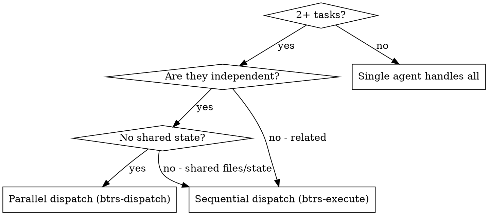

# BTRS Dispatch -- Parallel Agent Dispatch

## Overview

You delegate tasks to specialized agents with isolated context. By precisely crafting their instructions and context, you ensure they stay focused and succeed at their task. They should never inherit your session's context or history -- you construct exactly what they need. This also preserves your own context for coordination work.

When you have multiple unrelated problems (different files, different subsystems, different bugs), investigating them sequentially wastes time. Each investigation is independent and can happen in parallel.

**Core principle:** Dispatch one agent per independent problem domain. Let them work concurrently.

## Step 0 -- Load Context

Before dispatching any agents, read these files:

1. `config.md` -- project configuration and conventions
2. `discipline-protocol.md` -- quality standards and constraints
3. `workflow-protocol.md` -- dispatch rules and announcement requirements
4. `agent-registry.md` -- available agent types and their capabilities

Do NOT skip this step. You need to know what agents are available and what protocols govern dispatch.

## Decision Flow



**Use parallel dispatch when:**
- 2+ tasks exist with different root causes
- Multiple subsystems broken independently
- Each problem can be understood without context from others
- No shared state or files between tasks

**Do NOT use parallel dispatch when:**
- Failures are related (fixing one might fix others)
- Agents would modify the same files
- Tasks have sequential dependencies
- You need to understand full system state before acting

## Per-Agent Dispatch Requirements

Each dispatched agent MUST receive:

1. **Announcement** -- Announce each dispatch with context (who, what, why) per workflow protocol Rule 2
2. **Specific scope** -- One file or one subsystem, never "fix everything"
3. **Clear goal** -- Exact outcome expected, measurable where possible
4. **Explicit constraints** -- What NOT to touch, what NOT to change
5. **Discipline protocol injection** -- Include the discipline protocol so the agent follows quality standards
6. **Project conventions** -- Relevant config and conventions from config.md
7. **Output location** -- Each agent writes output to the appropriate btrs/ tier

## Dispatch Prompt Examples

### BAD Dispatch Prompts

```
Fix all failing tests
```
Too vague. Overlapping scope. Agent gets lost.

```
Fix the race condition
```
No context. Agent does not know where to look or what the symptoms are.

```
Refactor the auth module
```
No constraints. Agent might rewrite everything.

### GOOD Dispatch Prompts

```
Fix auth-middleware.test.ts -- the JWT verification test expects a 401 but gets
200. Only modify src/middleware/auth.ts and its test file. Do NOT change any
other middleware or route handlers. Return: root cause summary and list of
changed files.
```

```
Fix the batch-completion-behavior.test.ts failures -- 2 tests fail because
tools are not executing. The threadId is in the wrong place in the event
structure. Only modify src/events/batch.ts and its test. Return: what you
found and what you fixed.
```

```
Investigate why tool-approval-race-conditions.test.ts shows execution count = 0.
Read the test, trace the async flow, and add proper awaits for async tool
execution. Only modify the test file. Return: root cause and fix summary.
```

## After Agents Return

1. **Review summaries** -- Read each agent's output summary
2. **Check for conflicts** -- Did any agents modify the same files or overlapping code?
3. **Run full test suite** -- Verify all fixes work together
4. **Spot check results** -- Agents can make systematic errors; verify key changes
5. **If conflicts found** -- Resolve sequentially, do not re-dispatch in parallel

## Anti-Patterns

- **Do NOT** dispatch parallel agents that modify the same files
- **Do NOT** dispatch implementation agents in parallel (use btrs-execute for sequential implementation)
- **Do NOT** skip the conflict check after parallel completion
- **Do NOT** dispatch without reading agent-registry.md first
- **Do NOT** give agents broad scope ("fix everything in src/")
- **Do NOT** skip announcing each dispatch per workflow protocol

## Verification

After all agents return and changes are integrated:

1. **Review each summary** -- Understand what changed and why
2. **Check for conflicts** -- Verify no agents edited the same code
3. **Run full suite** -- All tests must pass with combined changes
4. **Spot check** -- Manually verify at least one fix per agent
5. **If anything fails** -- Debug sequentially, do not re-dispatch blindly
